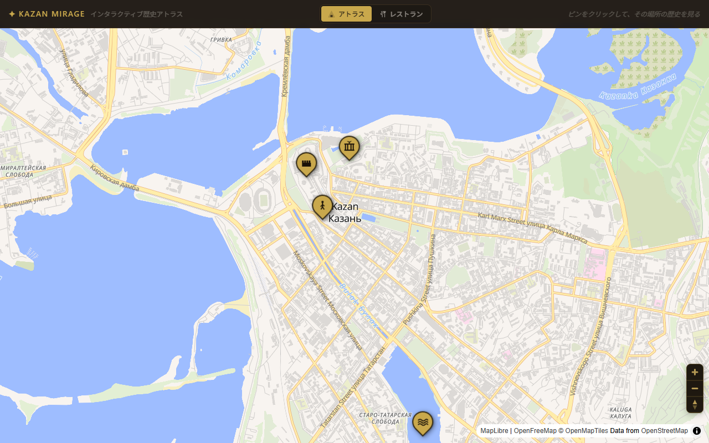
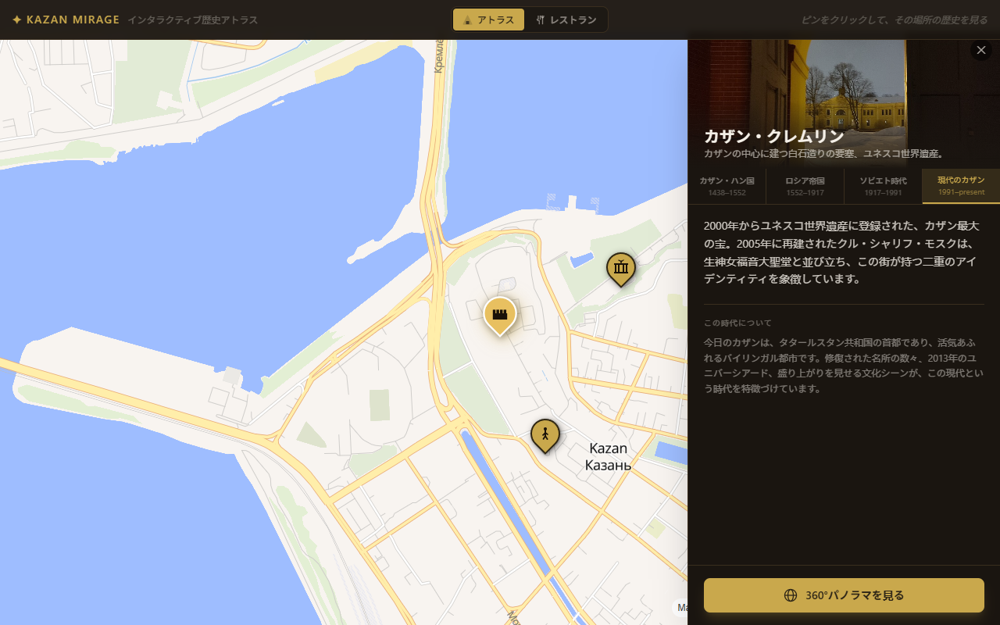
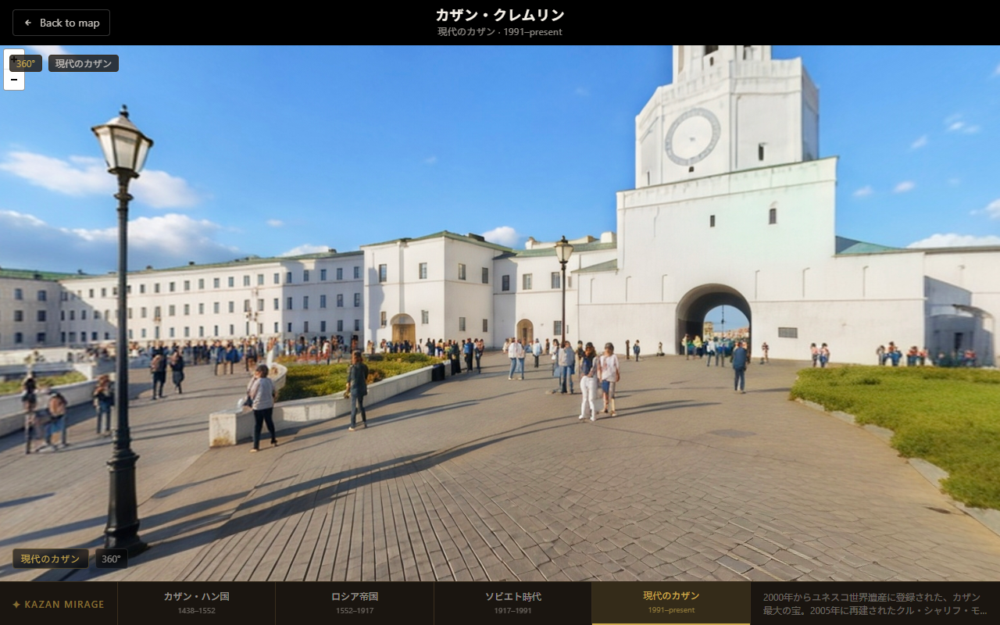
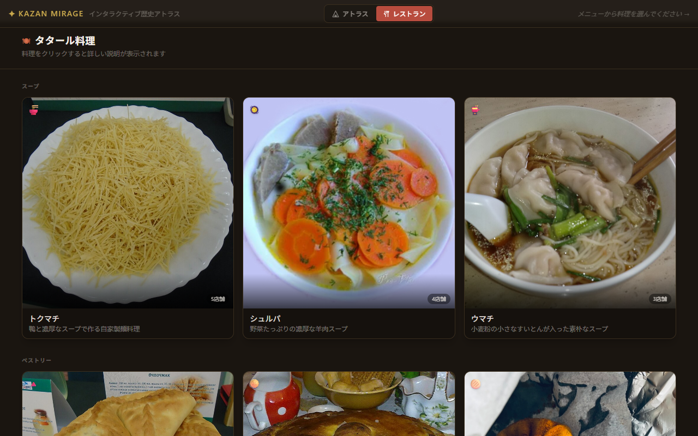

# ✦ Kazan Mirage

[](https://kazan-mirage.netlify.app)

**Interactive historical atlas of Kazan, Russia.**  
Click a landmark, pick an era, and watch descriptions and 360° panoramas shift across four centuries of history.

> 🔗 **Live demo:** **[kazan-mirage.netlify.app](https://kazan-mirage.netlify.app)**

---

## Screenshots

<table>
  <tr>
    <td align="center" width="50%">
      
      <sub>Interactive map — 5 landmarks with custom gold markers</sub>
    </td>
    <td align="center" width="50%">
      
      <sub>Side panel — per-era descriptions with era switcher</sub>
    </td>
  </tr>
  <tr>
    <td align="center" width="50%">
      
      <sub>360° panorama viewer — switchable across all eras</sub>
    </td>
    <td align="center" width="50%">
      
      <sub>Tatar cuisine mode — dish gallery + restaurant map</sub>
    </td>
  </tr>
</table>

---

## Features

- **5 historical landmarks** — Kazan Kremlin, Bauman Street, Palace of Agriculture, Family Center "Kazan", Lake Kaban
- **4 eras per landmark** — Kazan Khanate (1438–1552) → Russian Empire (1552–1917) → Soviet era (1917–1991) → Modern Kazan (1991–present)
- **Era switching everywhere** — map header, side panel, and panorama view all stay in sync
- **360° panoramas** — 20 equirectangular images (5 places × 4 eras), drag-to-look with auto-rotation
- **Tatar cuisine mode** — 10 authentic dishes with image galleries, ingredients, full descriptions, and a restaurant map with 10 fictional venues
- **Illustrated SVG map** — hand-drawn parchment-style map of Kazan (compass rose, cartouche, river labels)
- **Japanese-language UI** — all landmark and dish descriptions written in Japanese

---

## Tech Stack

| Layer | Technology |
|-------|------------|
| Framework | [Next.js 14](https://nextjs.org/) (App Router) |
| Language | TypeScript |
| Styling | Tailwind CSS |
| Map | [MapLibre GL JS](https://maplibre.org/) + [react-map-gl](https://visgl.github.io/react-map-gl/) |
| Map tiles | [OpenFreeMap](https://openfreemap.org/) — no API key required |
| 360° viewer | [Pannellum](https://pannellum.org/) (loaded from CDN) |

---

## Project Structure

```
├── app/
│   ├── page.tsx           # Main page — global state & layout
│   ├── layout.tsx         # HTML shell & metadata
│   └── globals.css        # Global styles + MapLibre overrides
│
├── components/
│   ├── KazanMap.tsx       # Interactive map with markers
│   ├── SidePanel.tsx      # Landmark panel with era switcher
│   ├── PanoramaFullscreen.tsx  # Fullscreen 360° view
│   ├── PanoramaViewer.tsx      # Pannellum wrapper
│   ├── MenuPanel.tsx      # Tatar cuisine menu (list / detail / map)
│   └── IllustratedMap.tsx # Hand-drawn SVG map
│
├── data/
│   ├── eras.json          # 4 historical eras
│   ├── places.json        # 5 landmarks with per-era content
│   ├── dishes.json        # 10 Tatar dishes
│   └── restaurants.json   # 10 fictional restaurants
│
└── public/
    └── panoramas/         # 20 panorama images ({place}_{era}.png)
```

---

## Getting Started

```bash
# Clone
git clone https://github.com/WerKo4Nec3/kazan-mirage.git
cd kazan-mirage

# Install
npm install

# Run dev server
npm run dev
```

Open [http://localhost:3000](http://localhost:3000).

---

## Adding Content

**New landmark** — add an entry to `data/places.json` with coordinates, a `coverImage` URL, and an `eras` object with up to 4 keys (`khanate`, `imperial`, `soviet`, `modern`). Each key holds a `description` (Japanese text) and a `panoramaImage` path (without extension).

**New panorama** — drop a `{place}_{era}.png` (or `.jpg`) file into `public/panoramas/`. The viewer auto-detects the extension.

**New dish** — add to `data/dishes.json`, then reference its `id` in the relevant restaurants' `dishIds` array in `data/restaurants.json`.
